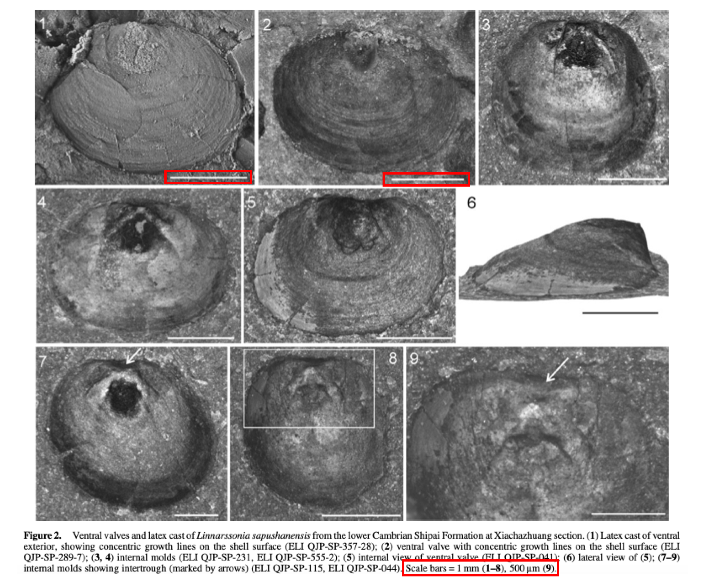
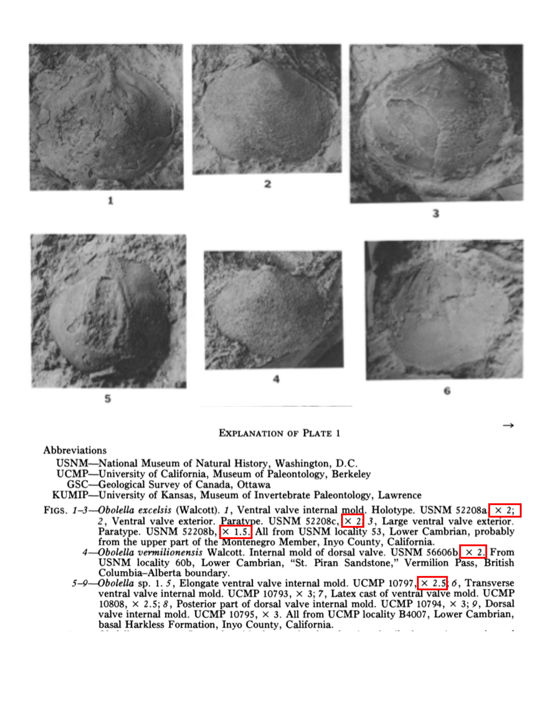
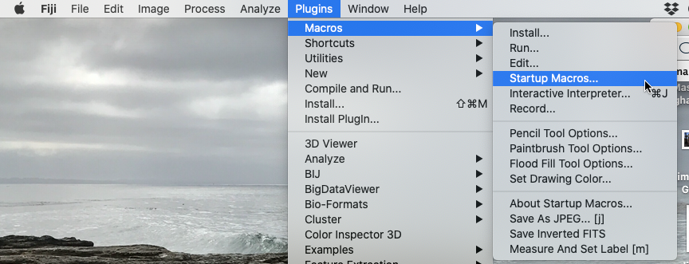
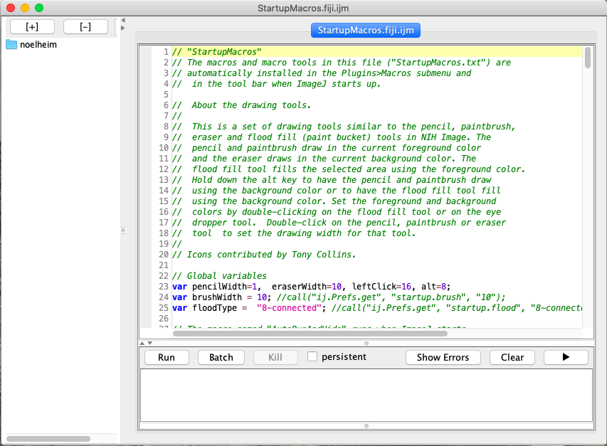
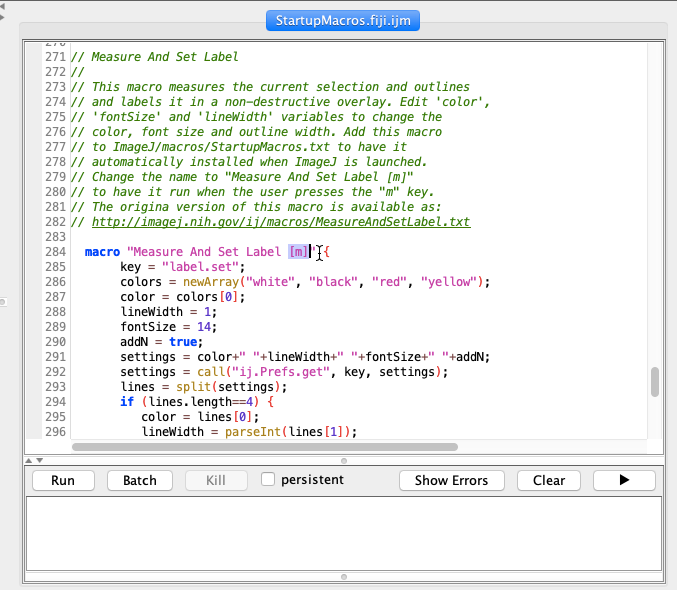
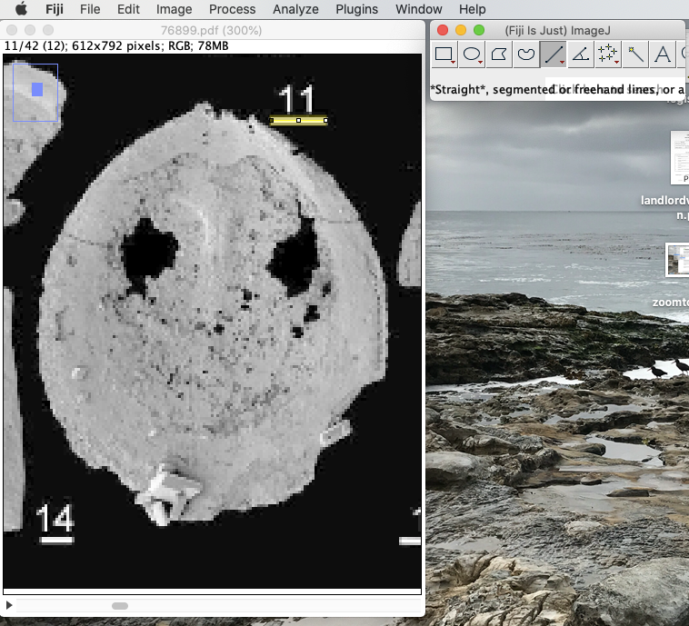
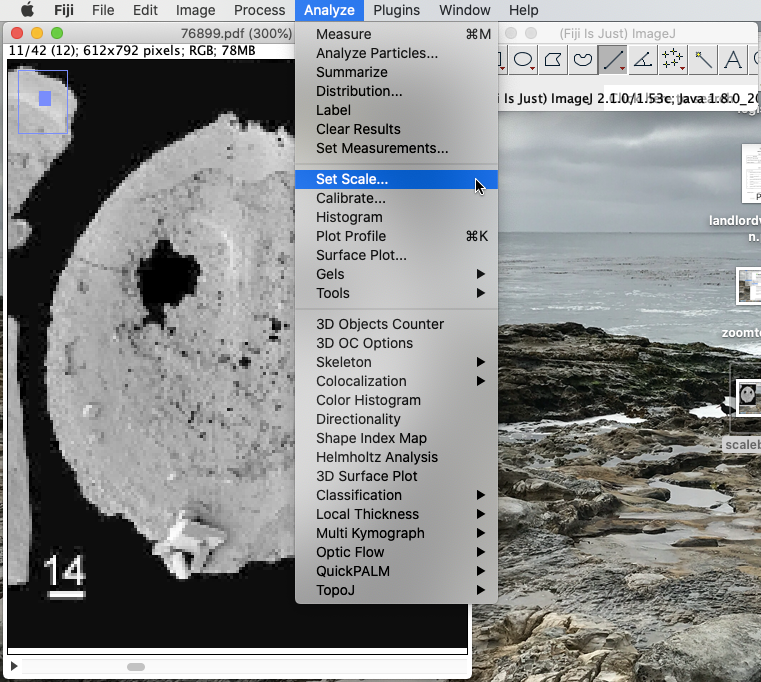
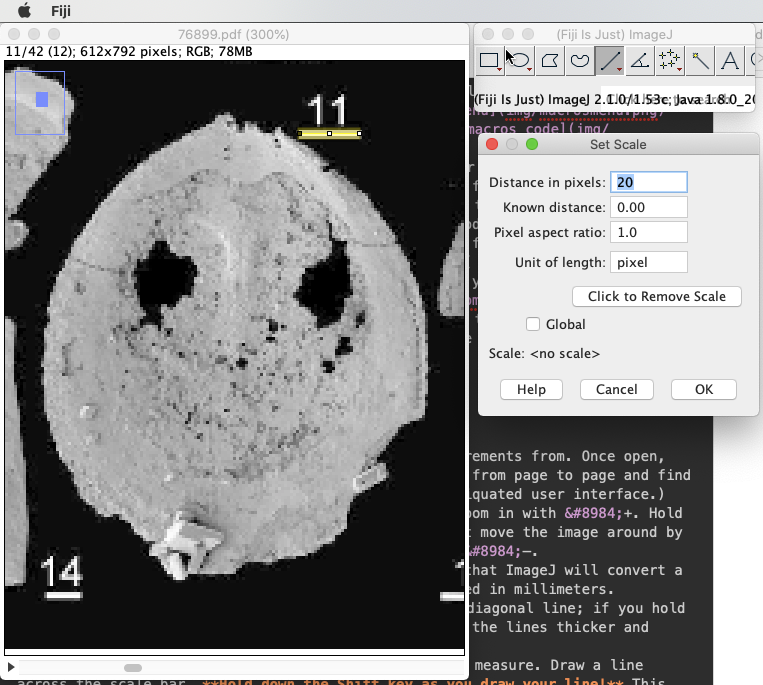
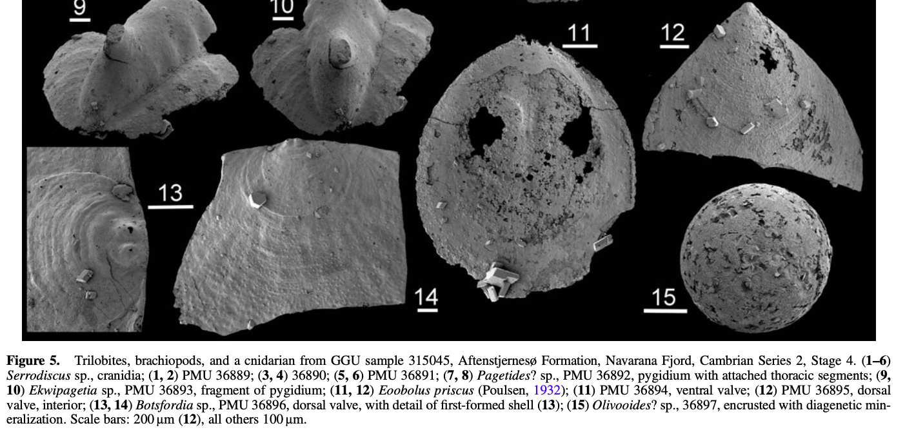

# Detailed Workflow

updated: 04 June 2021

### Needed Software
* [Box Drive](https://access.tufts.edu/box): A file sharing and cloud backup system. Tufts pays for students to have access to an 'unlimited' account with no charge for the student. To download, login with your Tufts credentials, Click on the icon with your initials in the upper right corner of the screen, select *Apps* from the dropdown menu, then click *Box Drive* to get the install files and instructions.
* Spreadsheet software: We will use a spreadsheet to enter and store data. There are a number of options, so whichever one you are most comfortable with is fine. Options include Excel, Numbers, and Google Sheets.
* [Fiji](https://imagej.net/Fiji) distribution of imageJ: A software package that allows us to make measurements from digital images. 
* [R](https://cran.r-project.org): An statistical analysis and graphics software package. This is a powerful open source platform that is the standard in many scientific disciplines, including paleontology.

---
### Download Papers from Internet
1. Reference information is in the file titled *pbdb\_refs\_2021\_05\_24.xlsx*, which you can open with Excel, Numbers, or Google Sheets.
2. Use [Google Scholar](https://scholar.google.com) or [Tufts Jumbo Search](https://tufts-primo.hosted.exlibrisgroup.com/primo-explore/search?vid=01TUN&lang=en_US&sortby=rank) to search for article. If you are off campus, it's probably easier to start with the Tufts Jumbo Search since you can login and have access to most resources. Let me know if you have trouble getting access.
3. If the column titled *doi* has a value, this means there is a digital copy available. If there's a URL just copy and paste that into your browser. If there's an alphanumeric (most start with '10.'), you can type *doi.org/* into your browser, then paste the value from the spreadsheet after the forward slash. It should look something like: *[http://doi.org/10.1666/10-115.1](http://doi.org/10.1666/10-115.1)*. Unfortunately, there are a few rows where someone erroneously entered ISBN numbers into the doi field, these should be ignored.
4. If the *doi* field is blank, enter the text of the *reftitle* column into Google Scholar or Tufts Jumbo Search. 
5. If there is a PDF available for the paper, download it to the ***pdf_files*** folder on Box. Immediately, rename the pdf so that the *reference\_no* is the file name. The reference number for the paper is the third column of the spreadsheet. The file name should look something like: *64199.pdf*. This step is important so that we know which file goes with which reference. 
6. Once you have downloaded, renamed, and saved the file in Box, enter *yes* into the *digital\_available* column on the spreadsheet.
7. If you can't find a downloadable file after thoroughly searching Google Scholar and Tufts Jumbo Search, enter *no* into the *digital\_available* column on the spreadsheet and move on to the next reference.

---
### Determine if Download Papers are Useful
The fossil sizes of species are given in two ways in papers. The first is that they are written out in the taxonomic descriptions, sometimes even in tables. The second is that there are images with scale bars or magnifications.

#### _Image with Scale Bars_

##### The above image is an example of brachiopods that are illustrated in a paper using a scale bar. Notice that each specimen has its own scale bar. The lengths of the scale bar in real units are given in the caption.

#### _Image with Magnification_

##### The above image is an example of brachiopods that are illustrated in a paper using a magnification. Notice that each specimen may have a different magnification and that the magnifications are given in the caption.

Skim the article, to determine if it has usable sizes. This includes images with a scale, images with magnifications, a table of sizes, or a sizes listed in the species descriptions. If the sizes are in a table or species descriptions, be sure not use average sizes aggregated from multiple specimens. If there is a usable size, enter yes into the *can\_be\_measured* column. Finally, if a size is available, indicate if the sizes is from text, an image with a scale bar, or an image with a magnification in the *text\_bar\_mag* section by entering text, bar, or mag, respectively.

---
### Download \& Set up Fiji/ImageJ
ImageJ is a free software package developed by the U.S. National Institutes of Health for the purpose of analyzing images. The Fiji distribution has some additional built-in functionality. The main addition that's important here is that it allows users to easily add labels to the measurements made from an image.

1. Download and install the [Fiji distribution of ImageJ](https://imagej.net/Fiji). 
2. The first thing we want to do is add the "Measure And Set Label" macro to the startup macros file. This macro will allow you to add labels to your measurements, which as you will see below is essential for making sure we know exactly what has been measured for our final analyses. 
	- Go to the following web address in your favorite browser: [https://imagej.nih.gov/ij/macros/Measure_And_Set_Label.txt](https://imagej.nih.gov/ij/macros/Measure_And_Set_Label.txt). A web page with plain text should load. The first line should read: "// Measure And Set Label".
	- Open Fiji then open the Startup Macros window. Plugins > Macros > Startup Macros ... (see screenshot below). 
	- This will open a window that looks like this: 
	- Scroll to the bottom of the window, and hit enter to add an extra blank line to the code. Then copy and paste all of the text from the web page there.
	- Finally, you need to make one small modification to the code block you just pasted. Scroll back to the top of the block of code you just pasted. The first several lines are green; you need to modify the first non-green line. Add *\[m\]* between the word 'Label' and the curly brace ( } ) (see screenshot below). This will allow you to add a label every time you extract a measurement by hitting the m key. 
	- Quit Fiji and restart the application. Now every time you open Fiji, the macro will load automatically so you should never have to repeat the steps in this section.

---
### Making Measurements Using Fiji/ImageJ

- Open the PDF of the paper you want to extract measurements from. Once open, you can use the right and left arrow keys to navigate from page to page and find the figure of interest. (ImageJ has an annoyingly antiquated user interface.)
- Once you've found the figure you want to measure, zoom in with &#8984;+. Hold cursor over place on page you want centered. You can't move the image around by scrolling or with your mouse. To zoom out again, use &#8984;—. 
- The first thing you want to do is set the scale so that ImageJ will convert a size in pixels to real sizes of the objects illustrated in millimeters.
	- Select the line segment tool from the tool bar (diagonal line; if you hold the button down, a window will pop up so you can make the lines thicker and easier to see).
	- Zoom into the specimen and scale bar you want to measure. Draw a line across the scale bar. **Hold down the Shift key as you draw your line!** This will force your line to be straight. On the image below, a hellow line has been drawn across the length of the scale bare that is located under the number 11. 
	- Now you are ready to set the scale. Open the Set Scale window, which is under the Analyze menu. 
	- There are four items in this window that can be set. The first is *Distance in pixels*. This is the length of the scale bar in pixels and has already been set for you by ImageJ; in the example below, the scale bar is 20 pixels long.  Second is the known distance. You need to enter this from the figure caption. Unfortunately, ImageJ reduces the image quality on multi-page PDFs, so you may need to open the original PDF in Preview or some other PDF reader to read the catption. In this particular example, The scale bar for part 12 is 200 &mu;m and 100 &mu;m for all other parts. We're measuring part 11, so the scale bar is 100 &mu;m. 