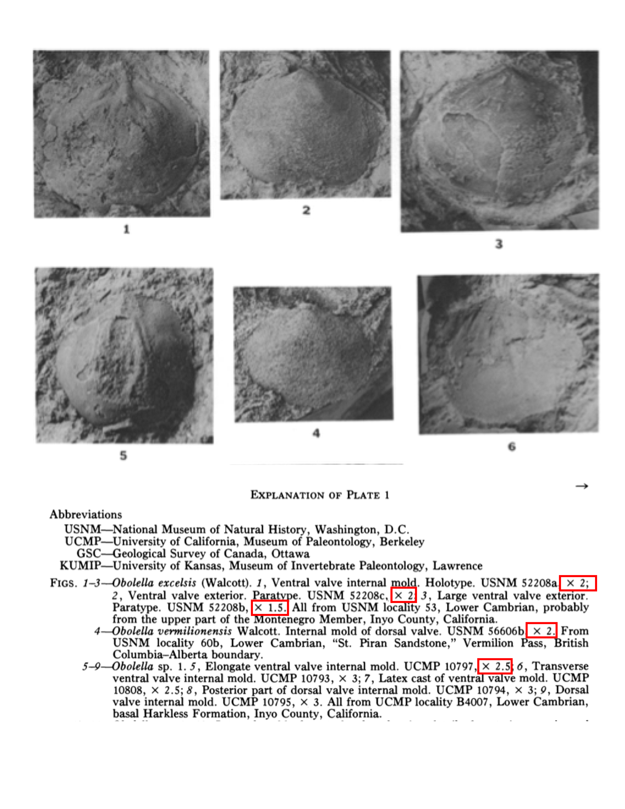
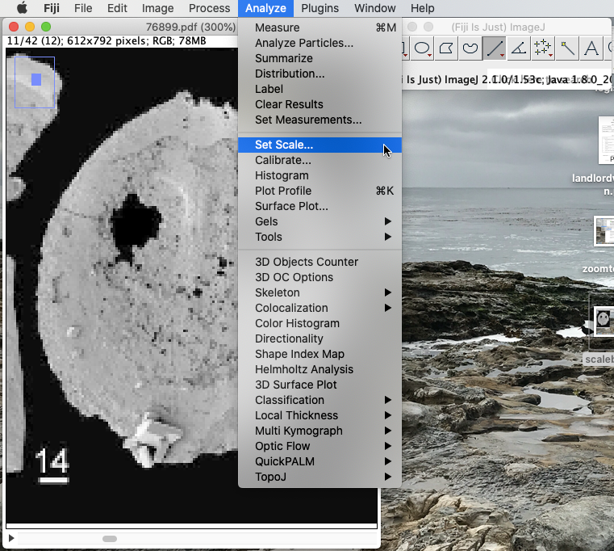
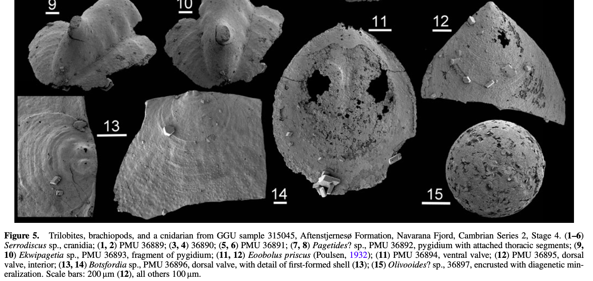
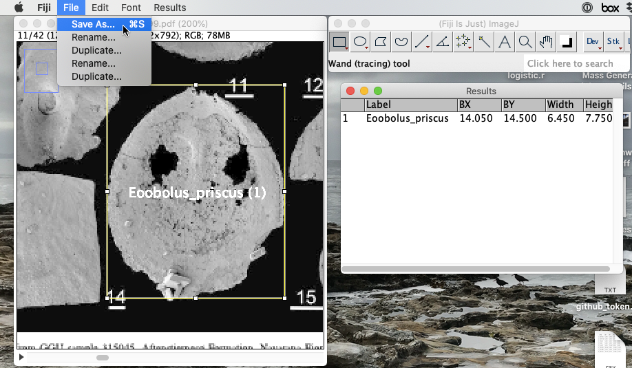

# Detailed Workflow

updated: 11 June 2021

### Needed Software
* [Box Drive](https://access.tufts.edu/box): A file sharing and cloud backup system. Tufts pays for students to have access to an 'unlimited' account with no charge for the student. To download, login with your Tufts credentials, Click on the icon with your initials in the upper right corner of the screen, select *Apps* from the dropdown menu, then click *Box Drive* to get the install files and instructions.
* Spreadsheet software: We will use a spreadsheet to enter and store data. There are a number of options, so whichever one you are most comfortable with is fine. Options include Excel, Numbers, and Google Sheets.
* [Fiji](https://imagej.net/Fiji) distribution of imageJ: A software package that allows us to make measurements from digital images.  **WINDOWS USERS** A notice from ImageJ about where to install the program on your computer: *If you are installing ImageJ on Windows, we strongly recommend that you store your ImageJ.app directory somewhere in your user space (e.g., C:\Users\[your name]\ImageJ.app) rather than in C:\Program Files or other system-wide directory. If you move ImageJ.app to such a directory, modern versions of Windows will deny ImageJ write permission to its own directory structure, preventing it from being able to update.*
* [R](https://cran.r-project.org): A statistical analysis and graphics software package. This is a powerful open source platform that is the standard in many scientific disciplines, including paleontology.

---
### Download Papers from Internet
1. Reference information is in the file titled *pbdb\_refs\_2021\_05\_24.xlsx*, which you can open with Excel, Numbers, or Google Sheets.
2. Use [Google Scholar](https://scholar.google.com) or [Tufts Jumbo Search](https://tufts-primo.hosted.exlibrisgroup.com/primo-explore/search?vid=01TUN&lang=en_US&sortby=rank) to search for article. If you are off campus, it's probably easier to start with the Tufts Jumbo Search since you can login and have access to most resources. Let me know if you have trouble getting access.
3. If the column titled *doi* has a value, this means there is a digital copy available. If there's a URL just copy and paste that into your browser. If there's an alphanumeric (most start with '10.'), you can type *doi.org/* into your browser, then paste the value from the spreadsheet after the forward slash. It should look something like: *[http://doi.org/10.1666/10-115.1](http://doi.org/10.1666/10-115.1)*. Unfortunately, there are a few rows where someone erroneously entered ISBN numbers into the doi field, these should be ignored.
4. If the *doi* field is blank, enter the text of the *reftitle* column into Google Scholar or Tufts Jumbo Search. 
5. If there is a PDF available for the paper, download it to the ***pdf_files*** folder on Box. Immediately, rename the pdf so that the *reference\_no* is the file name. The reference number for the paper is the third column of the spreadsheet. The file name should look something like: *64199.pdf*. This step is important so that we know which file goes with which reference. 
6. Once you have downloaded, renamed, and saved the file in Box, enter *yes* into the *digital\_available* column on the spreadsheet.
7. If you can't find a downloadable file after thoroughly searching Google Scholar and Tufts Jumbo Search, enter *no* into the *digital\_available* column on the spreadsheet and move on to the next reference.

---
### Determine if Download Papers are Useful
The fossil sizes of species are given in two ways in papers. The first is that they are written out in the taxonomic descriptions, sometimes even in tables. The second is that there are images with scale bars or magnifications.

#### _Image with Scale Bars_

##### The above image is an example of brachiopods that are illustrated in a paper using a scale bar. Notice that each specimen has its own scale bar. The lengths of the scale bar in real units are given in the caption.

#### _Image with Magnification_

##### The above image is an example of brachiopods that are illustrated in a paper using a magnification. Notice that each specimen may have a different magnification and that the magnifications are given in the caption.

Skim the article, to determine if it has usable sizes. This includes images with a scale, images with magnifications, a table of sizes, or a sizes listed in the species descriptions. If the sizes are in a table or species descriptions, be sure not use average sizes aggregated from multiple specimens. If there is a usable size, enter yes into the *can\_be\_measured* column. Finally, if a size is available, indicate if the sizes is from text, an image with a scale bar, or an image with a magnification in the *text\_bar\_mag* section by entering text, bar, or mag, respectively.

---
### Download \& Set up Fiji/ImageJ
ImageJ is a free software package developed by the U.S. National Institutes of Health for the purpose of analyzing images. The Fiji distribution has some additional built-in functionality. The main addition that's important here is that it allows users to easily add labels to the measurements made from an image.

1. Download and install the [Fiji distribution of ImageJ](https://imagej.net/Fiji). 
2. The first thing we want to do is add the "Measure And Set Label" macro to the startup macros file. This macro will allow you to add labels to your measurements, which as you will see below is essential for making sure we know exactly what has been measured for our final analyses. 
	- Go to the following web address in your favorite browser: [https://imagej.nih.gov/ij/macros/Measure_And_Set_Label.txt](https://imagej.nih.gov/ij/macros/Measure_And_Set_Label.txt). A web page with plain text should load. The first line should read: "// Measure And Set Label".
	- Open Fiji then open the Startup Macros window. Plugins > Macros > Startup Macros ... (see screenshot below). 
	- This will open a window that looks like this: 
	- Scroll to the bottom of the window, and hit enter to add an extra blank line to the code. Then copy and paste all of the text from the web page there.
	- Finally, you need to make one small modification to the code block you just pasted. Scroll back to the top of the block of code you just pasted. The first several lines are green; you need to modify the first non-green line. Add *\[m\]* between the word 'Label' and the curly brace ( } ) (see screenshot below). This will allow you to add a label every time you extract a measurement by hitting the m key. 
	- Quit Fiji and restart the application. Now every time you open Fiji, the macro will load automatically so you should never have to repeat the steps in this section.

---
### Making Measurements Using Fiji/ImageJ

- Open the PDF of the paper you want to extract measurements from. Once open, you can use the right and left arrow keys to navigate from page to page and find the figure of interest. (ImageJ has an annoyingly antiquated user interface.)
- Once you've found the figure you want to measure, zoom in with &#8984;+. Hold cursor over place on page you want centered. You can't move the image around by scrolling or with your mouse. To zoom out again, use &#8984;—. 
- The first thing you want to do is set the scale so that ImageJ will convert a size in pixels to real sizes of the objects illustrated in millimeters.
	- Select the line segment tool from the tool bar (diagonal line; if you hold the button down, a window will pop up so you can make the lines thicker and easier to see).
	- Zoom into the specimen and scale bar you want to measure. Draw a line across the scale bar. **Hold down the Shift key as you draw your line!** This will force your line to be straight. On the image below, a hellow line has been drawn across the length of the scale bare that is located under the number 11. 
	- Now you are ready to set the scale. Open the Set Scale window, which is under the Analyze menu. 
	- There are four items in this window that can be set. The first is *Distance in pixels*. This is the length of the scale bar in pixels and has already been set for you by ImageJ; in the example below, the scale bar is 20 pixels long.  Second is the known distance. You need to enter this from the figure caption. Unfortunately, ImageJ reduces the image quality on multi-page PDFs, so you may need to open the original PDF in Preview or some other PDF reader to read the catption. In this particular example, The scale bar for part 12 is 200 &mu;m and 100 &mu;m for all other parts. We're measuring part 11, so the scale bar is 100 &mu;m.  **THIS IS VERY IMPORTANT:** ***_ALL UNITS MUST BE IN MILLIMETERS (mm)_*** Millimeters (mm) will be the most common unit, so in most cases you won't have the make any conversions. But there are exceptions, as in the example here, where the units are given in micros (&mu;m). If the units given in the figure caption are not in millimeters you need to convert them before entering the *Known distance* parameter. There are 1000 microns in a millimeter, so to convert from microns to millimeters divide the number of microns by 1000. In the example here the scale bar is 100 &mu;m, which is equal to 100 &div; 1000 = 0.1. The *Known distance* is 0.1 mm.  You can leave *Pixel aspect ratio* at 1 (this just means the pixels are square rather than rectangular). Finally, change *Unit of length* to mm and hit OK! Now the scale is set for this image. 
	- You have to set the scale for every figure that has a different scale bar. You will also need to set the scale every time you start working on a new paper.

- The last thing you want to do before you start measuring, is set the type of measurement you want to make. In almost all cases we will want to measure the two maximum orthogonal dimensions of a shell's image. Rather than doing this as two separate linear measurements, we can use the square selection tool to make these two measurements at the same time. To to this you will need to *Set Measurements* from the *Analyze* menu.  This will open up a window with lots of choices you can check. The only two boxes we want checked are *Bounding rectangle* and *Display label*.  Once you have done this once, you should not need to do this again. Every time you open Fiji, these two selections will automatically be selected, so you shouldn't need to do it again.

- To make your measurements, you will use the rectangle selection tool to draw a bounding box around the fossil of interest and ImageJ will do all the work of converting pixels to millimeters.
- Once you draw the initial rectangle, you can make fine adjustments by "grabbing" and pulling the squares on the sized or corners of the bounding box.

- Once the bounding box is in the correct place, you're ready to make the measurement. Simply hit the ***m*** key.
- Now you will be asked to provide a label for your measurement. See below for the naming scheme. **The label and the way it's formatted is extremely important and should be done carefully**.
- 
- Once the label is entered, a new window will pop up with your measurement. Notice the first column contains the label you just entered. The next two columns *BX* and *BY* give the coordiantes of the upper left corner of the rectangle. The last two columns are the *Width* (horizontal distance) and *Height* (vertical distance), both in units of millimeters. 

- Repeat this procedure for all of the relevant fossils in the document. Remember:
	- If all the images on a figure have different scale bars, you need to reset the sale every time. However, if all or several fossils on the same figure have the same scale bar, you do not need to reset the scale every time.
	- Read below to understand how the write a properly formatted label.
- One of the unfortunate quarks of ImageJ is that the labels you create will display on every page of the paper unless you remove them. When you are done with all the measurments on a page, you can clear the labels from the screen (they will remain in the table) by going to **Image > Overlay > Remove Overlay**.

- Once you are done measuring all the fossils in a paper, you want to save your results. Make sure you have clicked on the Results table to bring it "to the front", then go to **File > Save As ...**.
- 
- The default option is to save the file as a csv (comma separated value) which is essentially a plain-text version of an Excel spreadsheet and the format we want. Finally, set the file name to the reference id number, which is the same as the paper's filename.
- 

### Labeling Measurements
In order to record some important information, we need to give our measurements a rather complicated label: there will five parts! Each of the six parts must be separated by an underscore (\_). Here is the general format: 

**Genus\_species\_FigNum\_HorizDim\_VertDim**

- Part 1: The genus name. This should be given in the figure caption, and is the first part of bipartite species name. In the example we've been using, the genus name is *Eoobolus*.
- Part 2: The species epithet. This is the second part of the species name. In the example we've been using, the species epithet is *priscus*.
- Part 3: The figure number. In the example we've been using, the fossil is figure 5.11 (figure 5 part 11). You can use reasonable abbreviations here. In this example, I would use **Fig5.11**. The main thing to ensure, is that this part of the label allows us to get back to the exact object you measured.
- Part 4: This is the horizontal dimension of the fossil measured. To understand this, it's important to be familiar with the dimensions of brachiopods and bivalves. In almost all of the figures you will see the brachiopods and bivalves will be oriented with their hinge/umbo at the top. For a brachiopod in this orientation, the horizontal dimension (parallel to the horizontal/top/bottom segments of the bounding box you drew) will be the width so this label part should be ***W***. However, for bivalves in this same orientation, the horizontal dimension is the length and an ***L*** should be entered. **SEE FIGURES BELOW**. 
- Part 5: This is the vertical dimension of the fossil measured. For a brachiopod in the standard orientation with the umbo up, the vertical dimension (parallel to the vertical/left/right segments of the bounding box you drew) will be the length. However, because the two valves of a brachiopod are not symmetrical, the lengths of the two valves are different. Look at the figure caption, it should tell you if you are measuring the dorsal valve (sometimes called brachial valve) or the ventral valve (sometime called pedicle valve). If you are measuring a dorsal valve enter ***Ld*** in the label. If you are measuring a ventral valve enter ***Lv*** in the label. 

In the example we've been using, the label should be: **Eoobolus\_ priscus\_Fig5.11\_W\_Lv**

**Note that some fossils may be in different orientations, so see the diagrams and table below to make sure all the correct information is entered.**

#### Dimension Codes

| Taxon        | Code           | Dimension  |
| ------------- |-------------| -----|
| Brachiopod      | W | Width (same for both valves) |
| Brachiopod      | Lv | Length of ventral or pedicle valve (longest of two valves) |
| Brachiopod      | Ld | Length of dorsal or brachial valve (shortest of two valves) |
| Brachiopod      | H | Height of both valves together |
| Brachiopod      | Hv | Height of ventral or pedicle valve if only one is illustrated |
| Brachiopod      | Ld | Height of dorsal or brachial valve if only one is illustrated |
| Bivalve      | L | Length (same for both valves) |
| Bivalve      | H | Height (same for both valves) |
| Bivalve      | W | Width of both valves together |
| Bivalve      | Wv | Width of a single valve if only one is illustrated and left or right valve is not indicated|
| Bivalve      | Wl | Width of left valve if only left valve is illustrated |
| Bivalve      | Wr | Width of right valve if only right valve is illustrated |

#### Brachiopod Dimensions

*Img src: MacFarlan, D.A.B. (2019). Early Jurassic Terebratulide Brachiopods from Zealandia. Riv. It. Paleontol. Strat., 125(3): 551-586.*

#### Bivalve Dimensions

*Img src: Zeng, Y. & Yang, H. (2021). Review of molluscan bivalve condition index calculations and application in Northern Quahogs Mercenaria mercenaria. Aquaculture Research, 52(1): 23-36.*

